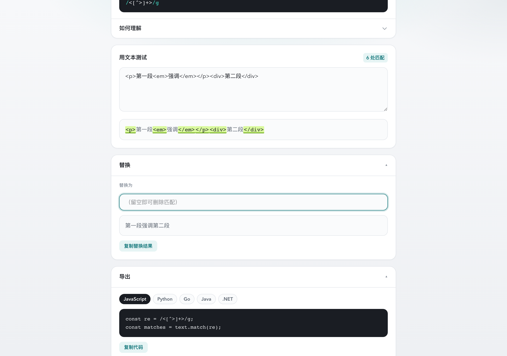
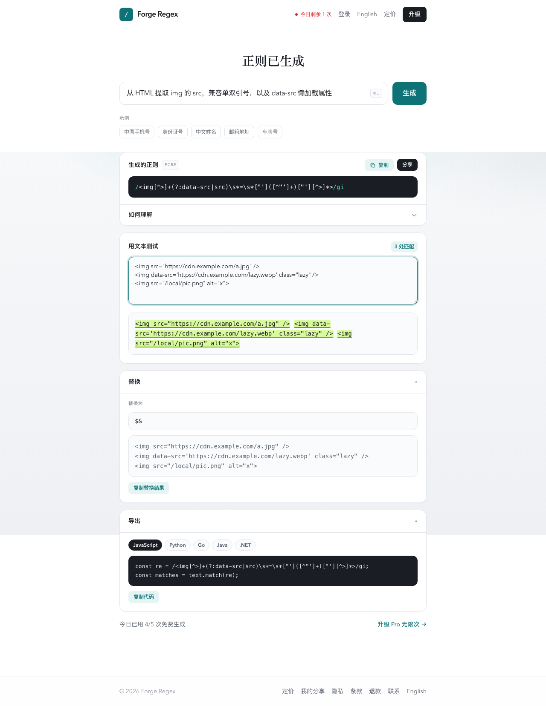

# 写爬虫时我懒得再手搓正则了

> 适合：掘金 / CSDN / 博客园 / SegmentFault / 头条号  
> 产品：Forge Regex · https://www.ststudio.top/works/forge-regex  
> 个人独立产品 · Pro ¥9.9/月（微信 / 支付宝）

---

写爬虫时我经常干这种蠢事：

跟 ChatGPT 要一条抽 `href` 的正则 → 粘到测试站 → 单引号挂了，或者懒加载的 `data-src` 根本没匹配到 → 再改一版 prompt → 再粘。来回几趟，半天没写业务逻辑。

元字符其实就那点东西。烦的是对着真实脏 HTML，能不能快点收敛。我自己做了个小工具：**中文说需求，出正则，同页贴 HTML 测匹配、替换，顺手导出代码**。

https://www.ststudio.top/works/forge-regex


---

## 正则到底能不能啃 HTML？

能扛这些活：

- 列表页批量抽链接、图片、meta  
- 粗清洗标签、抽 URL、抽 title  
- script 里埋的简单键值  

别指望它处理任意嵌套、标签不闭合、前端动态拼出来的烂 DOM。那种请上 cheerio / lxml / BeautifulSoup。下面都是我觉得正则更划算的场景。

---

## 抽所有 a 的 href（单双引号）

我会这么描述：

> 从 HTML 提取所有 a 标签的 href 属性值，兼容单引号和双引号

出来一般长这样：

```regex
/(?<=href\s*=\s*['"])[^'"]+/gi
```

样例：

```html
<a href="https://example.com/a">A</a>
<a href='https://news.cn/path?x=1'>B</a>
<a class="x" href="/relative/page">C</a>
<span>假的 href=notquoted</span>
```

同页会高亮匹配，也能直接导出 JS / Python：


---

## 粗暴去标签，洗正文

描述：

> 去掉所有 HTML 标签只保留纯文本

常见结果：

```regex
/<[^>]+>/g
```

关键一步：在「替换」里把匹配换成**空字符串**（别填 `$&`，那等于没删）。洗完再处理 `&nbsp;`、`&amp;` 之类。



这招会拆掉所有标签。脚本、style 没先抠掉的话，可能脏一脸——正经站点最好先定位正文容器再洗。

---

## 图片 src + 懒加载 data-src

列表页常见：

```html


```

描述：

> 从 HTML 提取 img 的 src，兼容单双引号，以及 data-src 懒加载属性

类似：

```regex
/(?<=(?:data-src|src)\s*=\s*['"])[^'"]+/gi
```



---

## 生成完还能干啥

我日常还会用到：

- 导出 JS / Python / Go / Java / .NET 片段，flags 一起写好  
- 替换预览：去标签、改链接，当场看结果  
- 展开「如何理解」，看每个 token 在干嘛  
- Pro 可以分享链接；「我的分享」里能回看，同事点开是同一条正则和测试文本  

---

## title，以及更多脏活

抽标题：

```regex
/<title[^>]*>([\s\S]*?)<\/title>/i
```

绝对 URL、meta、注释、中文段落粗筛之类，我另写了份速查：`cheatsheet-crawler-regex.md`。

也有人直接扔中文需求，比如：

- 「匹配包含下一页三个字的 a 标签并捕获 href」  
- 「从 script 里提取 listApi 冒号后面的接口路径」

---

## 和 ChatGPT 来回粘比什么

| | ChatGPT 来回粘 | 这个工具 |
|--|----------------|----------|
| 生成 | 有 | 有，中文就行 |
| 同页测真实 HTML | 无 | 有高亮 |
| 替换预览 | 无 | 有 |
| 导出多语言 | 自己抄 | 一键导出 |
| 付钱 | — | 微信 / 支付宝 ¥9.9/月 Pro |

游客能试 2 次，登录后每天 8 次。真每天狂生成再开 Pro 也行。


---

## 我自己写爬虫时的习惯

提示词把边界写死：单双引号？懒加载？要不要捕获组？样例故意放点脏数据，看会不会误伤。能解析 DOM 就别硬刚正则——正则适合干脏活、干快活。

试用：https://www.ststudio.top/works/forge-regex  

个人产品，有坑直接骂。Pro ¥9.9/月，微信扫码或支付宝都行。
