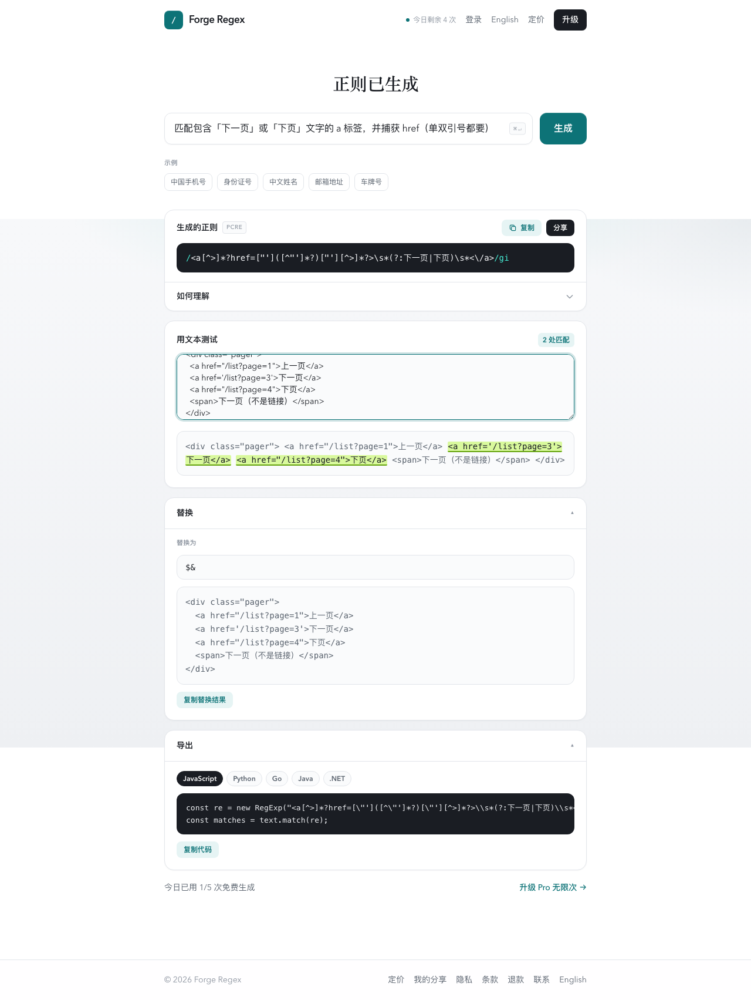
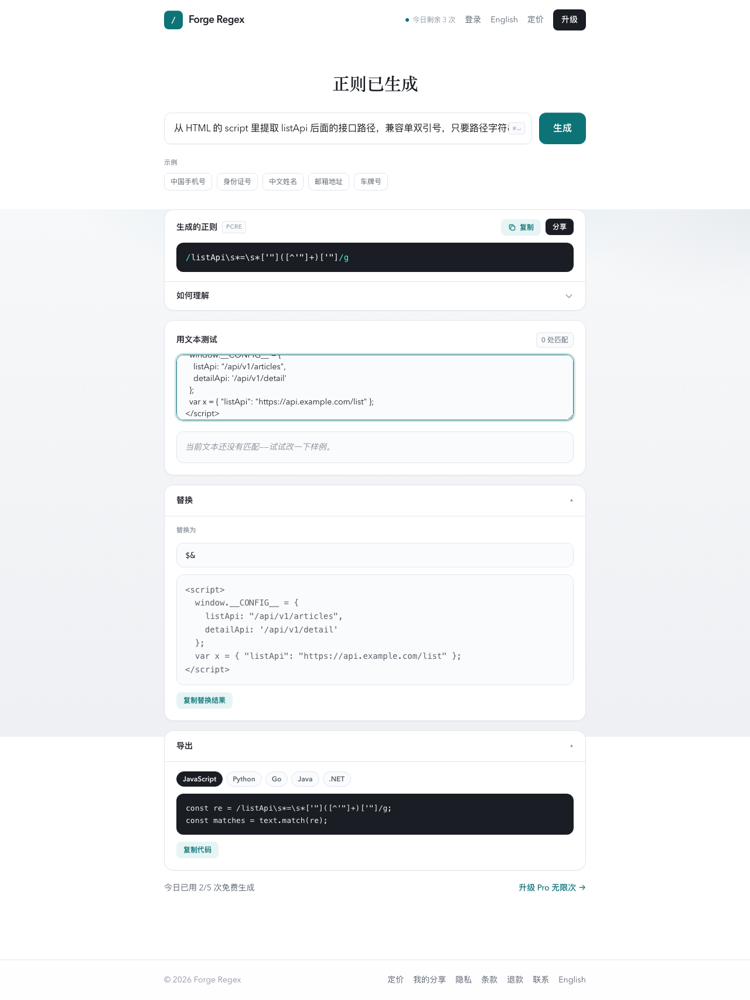

# 专题：列表「下一页」+ script 里抠接口

爬列表页两个高频需求：翻页链接、页面里埋的 API。都可以中文生成后同页验证。

工具：https://www.ststudio.top/works/forge-regex

---

## 1. 匹配「下一页 / 下页」并抓住 href

**提示词：**

> 匹配包含「下一页」或「下页」文字的 a 标签，并捕获 href（单双引号都要）

**样例：**

```html
<div class="pager">
  <a href="/list?page=1">上一页</a>
  <a href='/list?page=3'>下一页</a>
  <a href="/list?page=4">下页</a>
  <span>下一页（不是链接）</span>
</div>
```

截图：



爬虫侧：取捕获组里的 URL，拼到当前域名即可。注意有的站点「下一页」在 `button` 或 `javascript:` 里——提示词里写清楚标签类型。

---

## 2. 从 `<script>` 埋点抽 `listApi`

很多站点把接口写在首屏配置里，例如：

```html
<script>
  window.__CONFIG__ = {
    listApi: "/api/v1/articles",
    detailApi: '/api/v1/detail'
  };
  var x = { "listApi": "https://api.example.com/list" };
</script>
```

**提示词：**

> 从 HTML 的 script 里提取 listApi 后面的接口路径，兼容单双引号，只要路径字符串

截图：



进阶提示词可改成：

- `提取 window.__INITIAL_STATE__ 里 articles 数组附近的 api 字段`  
- `匹配 "totalPage": 后面的数字`  
- `抽取 script 里所有 /api/ 开头的路径`

拿到接口后，往往比硬解析 DOM 列表更稳。

---

## 和解析器怎么分工

| 步骤 | 建议 |
|------|------|
| 发现翻页 / 埋点 URL | 正则快 |
| 稳定翻多页、抗改版 | 优先直接调 API；DOM 用解析器 |
| 正文已是一大坨 HTML 字符串 | 正则粗洗 + 解析器精提 |

---

相关长文：`2026-07-29-juejin-crawler-regex.md`  
速查表：`cheatsheet-crawler-regex.md`
